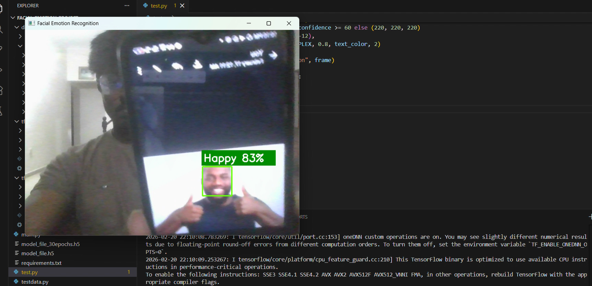
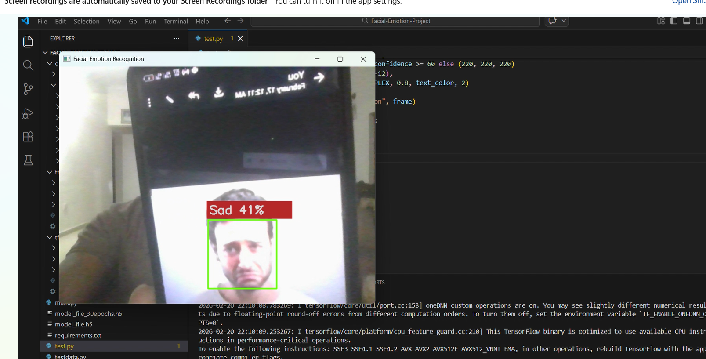

# Facial Emotion Recognition using Deep Learning

Real-time facial emotion detection system using a Convolutional Neural Network (CNN) trained on the FER-2013 dataset.

Detects 7 emotions: **Angry, Disgust, Fear, Happy, Neutral, Sad, Surprise**


## Project Overview

This project implements a facial emotion recognition model using Keras/TensorFlow.  
The model was trained on grayscale 48×48 face images and can run in real-time using a webcam or on static images.

### Dataset

- **Name**: FER-2013 (Facial Expression Recognition 2013)
- **Source**: Kaggle
- **Link**: https://www.kaggle.com/datasets/msambare/fer2013
- **Alternative (already in folder structure)**: https://www.kaggle.com/datasets/astraszab/facial-expression-dataset-image-folders-fer2013
- **Total images**: ≈ 35,887 grayscale 48×48 face images
- **Classes** (7 emotions):
  - Angry
  - Disgust
  - Fear
  - Happy
  - Neutral
  - Sad
  - Surprise
- **Class distribution**: Highly imbalanced (Happy ~8k images, Disgust ~500 images)

### Data Preprocessing

- Images are already 48×48 grayscale (no extra resizing needed)
- Normalization: pixel values divided by 255 → range [0, 1]
- Data augmentation applied during training:
  - Rotation (±30°)
  - Shear (0.3)
  - Zoom (0.3)
  - Horizontal flip
  - Fill mode: nearest

### Model Architecture

Simple but effective CNN:

- Input shape: (48, 48, 1)
- 4 convolutional blocks:
  - Conv2D (32 → 64 → 128 → 256 filters)
  - ReLU activation
  - MaxPooling2D (2×2)
  - Dropout (0.1)
- Flatten → Dense(512, ReLU) → Dropout(0.2) → Dense(7, softmax)
- Optimizer: Adam
- Loss: Categorical Crossentropy
- Metrics: Accuracy
- Training: 30 epochs

## Demo / Results

Here are some example outputs from the real-time webcam demo (`test.py`) and static image tests:

<p align="center">
  
  
  
</p>

<p align="center">
  <em>Live detections showing different emotions with bounding boxes and labels</em>
</p>

(Images are shown side-by-side on wide screens and stack vertically on smaller devices.)

## Folder Structure
Facial-Emotion-Project/

 ├── data/ 
 
 │   ├── train/
 
 │   │   ├── Angry/
 
 │   │   ├── Disgust/
 
 │   │   ├── Fear/
 
 │   │   ├── Happy/
 
 │   │   ├── Neutral/
 
 │   │   ├── Sad/
 
 │   │   └── Surprise/
 
 │   └── test/ 
 
 ├── tf-env/ 
 
 ├── main.py                      
 ├── test.py                      # real-time webcam demo
 
 ├── testdata.py                  # static image test
 
 ├── model_file.h5                # latest trained model (~29 MB)
 
 └── README.md

 ## Installation

## Quick Start – Step-by-Step

### 1. Clone or Download the Repository

**Clone with Git** (recommended):
```bash
git clone https://github.com/Thisurika-Hasajith-Padmasiri/Facial-Emotion-Project.git
cd Facial-Emotion-Project

### 2. Set Up Python Environment
# Create virtual environment
python -m venv env

# Activate it
env\Scripts\activate           # Windows
# or
source env/bin/activate        # macOS / Linux

### 3. Install Dependencies

# Method A – Helper script
python install_dependencies.py

# Method B – Using requirements.txt
pip install -r requirements.txt

# Manual install
pip install tensorflow opencv-python numpy scipy scikit-learn

### Run the Project
python test.py

###For improvment you can train anoher model use data preprocessing techniques to get more accuracy


### Quick final actions

1. Replace your README.md with this content
2. Save
3. Commit & push:.................


